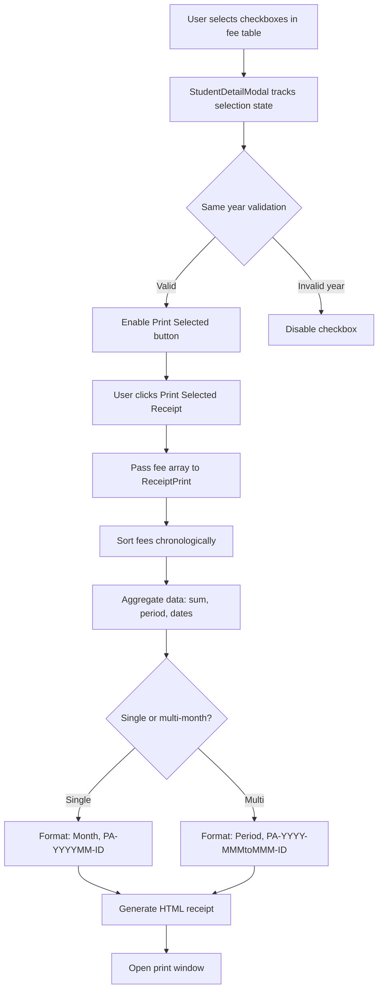

# Design Document: Multi-Month Receipt Support

## Overview

This design extends the existing fee receipt generation system to support consolidated receipts for multiple consecutive monthly payments. The system currently generates receipts for single-month fee records. This enhancement allows administrators to select multiple paid monthly fee records and generate a single receipt showing the period range and aggregated amount.

**Key Design Decisions:**
- **Read-only operation**: No Firestore writes - pure aggregation of existing data
- **Component-based approach**: Extend existing `ReceiptPrint.jsx` and `StudentDetailModal.jsx` components
- **Backward compatible**: Single-month receipt generation remains unchanged
- **Same-year constraint**: Multi-month receipts limited to records within the same calendar year for clarity

**Design Goals:**
1. Minimal code changes to existing receipt template
2. Preserve existing A4 dual-copy layout (133mm per copy)
3. Support both single-month and multi-month receipt formats
4. Ensure chronological correctness in period display

## Architecture

### Component Structure

```
StudentDetailModal.jsx (UI Layer)
    ├── Fee selection state management
    ├── Same-year validation logic
    ├── Checkbox UI rendering
    └── Calls ReceiptPrint with fee array

ReceiptPrint.jsx (Business Logic Layer)
    ├── Accepts single fee OR array of fees
    ├── Chronological sorting
    ├── Data aggregation (sum, period range)
    ├── Receipt number generation
    └── HTML/CSS template rendering
```

### Data Flow



### State Management

**StudentDetailModal State:**
```javascript
{
  fees: Array<FeeRecord>,           // All fee records from Firestore
  selectedFees: Array<FeeRecord>,   // Currently selected fee records
  selectedYear: number | null       // Year constraint for current selection
}
```

**FeeRecord Type:**
```javascript
{
  docId: string,
  studentId: string,
  month: string,        // "January", "February", etc.
  year: number,         // 2025, 2026, etc.
  amount: number,       // INR amount
  status: "paid" | "pending",
  paymentDate: Date | string
}
```

## Components and Interfaces

### StudentDetailModal Modifications

**New State Variables:**
```javascript
const [selectedFees, setSelectedFees] = useState([])
const [selectedYear, setSelectedYear] = useState(null)
```

**New Functions:**

```javascript
/**
 * Handles checkbox toggle for fee record selection
 * @param {FeeRecord} fee - The fee record to toggle
 * @param {boolean} isChecked - New checkbox state
 */
function handleFeeSelection(fee, isChecked) {
  if (isChecked) {
    // Add to selection
    setSelectedFees(prev => [...prev, fee])
    
    // Set year constraint if first selection
    if (selectedFees.length === 0) {
      setSelectedYear(fee.year)
    }
  } else {
    // Remove from selection
    setSelectedFees(prev => prev.filter(f => f.docId !== fee.docId))
    
    // Clear year constraint if no selections remain
    if (selectedFees.length === 1) {
      setSelectedYear(null)
    }
  }
}

/**
 * Determines if a checkbox should be disabled based on year constraint
 * @param {FeeRecord} fee - The fee record to check
 * @returns {boolean} True if checkbox should be disabled
 */
function isCheckboxDisabled(fee) {
  // Always enabled if pending (they can't be selected anyway)
  if (fee.status === 'pending') return true
  
  // If no year constraint yet, enable all paid records
  if (selectedYear === null) return false
  
  // Disable if year doesn't match selected year
  return fee.year !== selectedYear
}

/**
 * Checks if a fee is currently selected
 * @param {FeeRecord} fee - The fee record to check
 * @returns {boolean} True if fee is in selection
 */
function isFeeSelected(fee) {
  return selectedFees.some(f => f.docId === fee.docId)
}
```

**UI Changes:**
- Add checkbox column as first column in fee table
- Render checkbox for each row: `<input type="checkbox" checked={isFeeSelected(fee)} disabled={isCheckboxDisabled(fee)} onChange={(e) => handleFeeSelection(fee, e.target.checked)} />`
- Show "Print Selected Receipt" button when `selectedFees.length > 0`
- Button calls `setPrintingFee(selectedFees)` instead of single fee object

### ReceiptPrint Component Modifications

**Modified Component Signature:**
```javascript
/**
 * ReceiptPrint Component
 * 
 * Opens a new window with a printable fee receipt containing two copies.
 * Now supports both single-month and multi-month receipts.
 * 
 * @param {Object} props - Component props
 * @param {Object} props.student - Student information
 * @param {string} props.student.id - Student identifier
 * @param {string} props.student.name - Student full name
 * @param {string} props.student.class - Student class/grade
 * @param {string} props.student.parentName - Parent or guardian name
 * @param {FeeRecord | FeeRecord[]} props.fee - Single fee record OR array of fee records
 * @param {Function} props.onClose - Optional callback to hide receipt after printing
 */
export default function ReceiptPrint({ student, fee, onClose })
```

**New Helper Functions:**

```javascript
/**
 * Month name to index mapping for chronological sorting
 */
const MONTH_INDEX = {
  'January': 1, 'February': 2, 'March': 3, 'April': 4,
  'May': 5, 'June': 6, 'July': 7, 'August': 8,
  'September': 9, 'October': 10, 'November': 11, 'December': 12
}

/**
 * Month name to 3-letter abbreviation mapping
 */
const MONTH_ABBR = {
  'January': 'Jan', 'February': 'Feb', 'March': 'Mar', 'April': 'Apr',
  'May': 'May', 'June': 'Jun', 'July': 'Jul', 'August': 'Aug',
  'September': 'Sep', 'October': 'Oct', 'November': 'Nov', 'December': 'Dec'
}

/**
 * Sorts fee records chronologically by year then month
 * @param {FeeRecord[]} fees - Array of fee records to sort
 * @returns {FeeRecord[]} Sorted array (earliest to latest)
 */
function sortFeesChronologically(fees) {
  return [...fees].sort((a, b) => {
    // Sort by year first
    if (a.year !== b.year) {
      return a.year - b.year
    }
    
    // Then by month index
    const monthA = MONTH_INDEX[a.month] || 0
    const monthB = MONTH_INDEX[b.month] || 0
    return monthA - monthB
  })
}

/**
 * Computes total amount from array of fee records
 * @param {FeeRecord[]} fees - Array of fee records
 * @returns {number} Sum of all amounts
 */
function computeTotalAmount(fees) {
  return fees.reduce((sum, fee) => sum + (fee.amount || 0), 0)
}

/**
 * Formats period label for receipt
 * @param {FeeRecord[]} sortedFees - Chronologically sorted fee records
 * @returns {string} "Month: {month} {year}" or "Period: {start} to {end}"
 */
function formatPeriodLabel(sortedFees) {
  if (sortedFees.length === 1) {
    const fee = sortedFees[0]
    return `Month: ${fee.month} ${fee.year}`
  }
  
  const first = sortedFees[0]
  const last = sortedFees[sortedFees.length - 1]
  
  return `Period: ${first.month} ${first.year} to ${last.month} ${last.year}`
}

/**
 * Generates receipt number for single or multi-month receipt
 * @param {FeeRecord[]} sortedFees - Chronologically sorted fee records
 * @param {string} studentId - Student identifier
 * @returns {string} Receipt number
 */
function generateMultiMonthReceiptNumber(sortedFees, studentId) {
  if (sortedFees.length === 1) {
    // Single month: PA-202601-STU001
    const fee = sortedFees[0]
    return generateReceiptNumber(fee.year, fee.month, studentId)
  }
  
  // Multi-month: PA-2026-AprtoJun-STU001
  const first = sortedFees[0]
  const last = sortedFees[sortedFees.length - 1]
  
  const firstAbbr = MONTH_ABBR[first.month] || 'Unk'
  const lastAbbr = MONTH_ABBR[last.month] || 'Unk'
  
  // Use year from first record
  const year = first.year
  
  // Truncate student ID to 20 characters
  const truncatedId = studentId && studentId.length > 20 
    ? studentId.slice(0, 20) 
    : studentId || ''
  
  return `PA-${year}-${firstAbbr}to${lastAbbr}-${truncatedId}`
}
```

**Component Logic Changes:**

```javascript
// Normalize fee prop to always be an array
const feeArray = Array.isArray(fee) ? fee : [fee]

// Sort chronologically
const sortedFees = sortFeesChronologically(feeArray)

// Compute aggregated data
const totalAmount = computeTotalAmount(sortedFees)
const periodLabel = formatPeriodLabel(sortedFees)
const receiptNumber = generateMultiMonthReceiptNumber(sortedFees, student.id)

// Use last fee's payment date
const lastFee = sortedFees[sortedFees.length - 1]
const formattedDate = formatPaymentDate(lastFee.paymentDate)
const formattedAmount = formatAmount(totalAmount)
```

**HTML Template Changes:**

Replace hardcoded "Month:" section with dynamic period label:

```html
<!-- OLD -->
<div class="info-row">
  <span class="info-label">Month:</span>
  <span class="info-value">${safeValue(fee.month)}</span>
</div>
<div class="info-row">
  <span class="info-label">Year:</span>
  <span class="info-value">${safeValue(fee.year)}</span>
</div>

<!-- NEW -->
<div class="info-row">
  <span class="info-label">${periodLabel.includes('Month:') ? 'Month:' : 'Period:'}</span>
  <span class="info-value">${periodLabel.replace(/^(Month:|Period:)\s*/, '')}</span>
</div>
```

## Data Models

No changes to Firestore data models. The feature operates entirely on existing `FeeRecord` documents.

**Fee Record Schema (unchanged):**
```javascript
{
  docId: string,          // Firestore document ID
  studentId: string,      // References student
  month: string,          // "January", "February", etc.
  year: number,           // 2025, 2026, etc.
  amount: number,         // Fee amount in INR
  status: string,         // "paid" or "pending"
  paymentDate: Date,      // Timestamp of payment
  archived: boolean       // Soft delete flag
}
```

## Correctness Properties

*A property is a characteristic or behavior that should hold true across all valid executions of a system—essentially, a formal statement about what the system should do. Properties serve as the bridge between human-readable specifications and machine-verifiable correctness guarantees.*

### Property Reflection

After analyzing all acceptance criteria, I identified the following redundancies:
- **Redundancy 1**: Properties 2.4 and 2.5 (extracting first/last element from sorted array) are subsumed by the chronological sorting property - if sorting is correct, first and last elements are automatically correct
- **Redundancy 2**: Properties 1.2 and 1.3 (checkbox enable/disable based on status) can be combined into a single property about checkbox state determination
- **Redundancy 3**: Property 8.2 and 8.3 (sorting logic) can be combined with Property 2.2 into a single comprehensive sorting property
- **Consolidation**: Properties 3.3 and 3.4 (display using aggregated data) are consequences of correct aggregation - testing aggregation functions covers these

### Property 1: Chronological Sorting Correctness

*For any* array of fee records with valid month names and years, when sorted chronologically, each record SHALL appear before all records with a later year, and within the same year, each record SHALL appear before all records with a later month index.

**Validates: Requirements 2.2, 2.4, 2.5, 8.2, 8.3**

### Property 2: Amount Aggregation Correctness

*For any* array of fee records, the computed total amount SHALL equal the sum of all individual amount fields.

**Validates: Requirements 2.3, 3.3**

### Property 3: Checkbox State Based on Status and Year

*For any* fee record in the fee table, the checkbox SHALL be disabled if and only if either (a) the fee status is "pending", or (b) a year constraint is active and the fee's year does not match the constraint year.

**Validates: Requirements 1.2, 1.3, 5.3**

### Property 4: Selection State Tracking

*For any* sequence of checkbox toggle operations, the selection state SHALL contain exactly the set of fee records whose checkboxes were most recently checked and not subsequently unchecked.

**Validates: Requirements 1.4**

### Property 5: Period Label Format Correctness

*For any* array of fee records, if the array length is 1, the period label SHALL contain "Month:" followed by the month and year; if the array length is greater than 1, the period label SHALL contain "Period:" followed by the first record's month/year, "to", and the last record's month/year (after chronological sorting).

**Validates: Requirements 3.1, 3.2**

### Property 6: Receipt Number Format for Multi-Month

*For any* array of two or more chronologically sorted fee records from the same year, the receipt number SHALL match the pattern "PA-{year}-{firstMonthAbbr}to{lastMonthAbbr}-{studentId}" where month abbreviations are 3-letter codes.

**Validates: Requirements 4.2, 4.3**

### Property 7: Month Name to Abbreviation Mapping

*For any* valid month name in the set {"January", "February", ..., "December"}, the month abbreviation function SHALL return the corresponding 3-letter code in the set {"Jan", "Feb", ..., "Dec"}.

**Validates: Requirements 4.3**

### Property 8: Same-Year Validation Constraint

*For any* non-empty selection of fee records, all records in the selection SHALL have identical year values.

**Validates: Requirements 5.1, 5.2, 5.3**

### Property 9: Payment Date Selection

*For any* array of chronologically sorted fee records, the displayed payment date SHALL equal the paymentDate field of the last record in the array.

**Validates: Requirements 3.4**

## Error Handling

### Validation Errors

**Empty Selection:**
- **Error**: User clicks "Print Selected Receipt" with no selections
- **Handling**: Button should not be visible when selection is empty (UI prevention)

**Mixed Year Selection:**
- **Error**: User attempts to select fees from different years
- **Handling**: Disable checkboxes for fees outside the selected year constraint
- **User Feedback**: Disabled checkboxes provide visual cue; tooltip could explain "Cannot mix years in one receipt"

**Invalid Month Name:**
- **Error**: Fee record contains unrecognized month name
- **Handling**: Log warning, use month index 0 (sorts to beginning), include "Unk" abbreviation in receipt number
- **Recovery**: Receipt still generates but with degraded formatting

**Missing or Invalid Amount:**
- **Error**: Fee record has null, undefined, negative, or NaN amount
- **Handling**: Treat as 0 in sum calculation, log warning
- **Receipt Display**: Show "₹0.00" for invalid amounts

**Missing Payment Date:**
- **Error**: Fee record has null or invalid paymentDate
- **Handling**: Display "N/A" in receipt, use existing `formatPaymentDate` error handling

### Edge Cases

**Single Fee Record (Backward Compatibility):**
- Component receives single fee object (not array)
- Normalize to array: `const feeArray = Array.isArray(fee) ? fee : [fee]`
- Behaves identically to current implementation

**Empty Fee Array:**
- **Should not occur** - Print button hidden when selection is empty
- **Defensive handling**: Return null, log error if it somehow occurs

**Unsorted Input:**
- Fee array passed in arbitrary order
- Always sort chronologically before processing
- Receipt displays correct period regardless of input order

## Testing Strategy

### Dual Testing Approach

This feature requires both **unit tests** for specific logic and **property-based tests** for universal properties that should hold across all inputs.

### Unit Tests

**Purpose**: Test specific examples, edge cases, and React component integration

**Test Cases:**

1. **Single-month receipt (backward compatibility)**
   - Input: Single fee object `{month: "April", year: 2026, amount: 5000}`
   - Expected: Receipt number "PA-202604-STU001", "Month: April 2026"

2. **Two-month receipt**
   - Input: `[{month: "April", year: 2026}, {month: "May", year: 2026}]`
   - Expected: Receipt number "PA-2026-AprtoMay-STU001", "Period: April 2026 to May 2026"

3. **Checkbox disabled for pending status**
   - Input: Fee record with `status: "pending"`
   - Expected: Checkbox rendered with `disabled={true}`

4. **Checkbox disabled for different year**
   - State: `selectedYear = 2026`
   - Input: Fee record with `year: 2025`
   - Expected: Checkbox disabled

5. **Print button visibility**
   - Case A: `selectedFees = []` → Button not rendered
   - Case B: `selectedFees = [{...}]` → Button rendered

6. **No Firestore writes**
   - Mock Firestore methods
   - Execute receipt generation
   - Assert: No calls to `createFeeRecord`, `softDeleteFeeRecord`, or any write methods

### Property-Based Tests

**Library**: Use `fast-check` (JavaScript property-based testing library)

**Configuration**: Minimum 100 iterations per property test

**Test Tags**: Format: `Feature: multi-month-receipt-support, Property {number}: {property_text}`

**Property Test 1: Chronological Sorting**
```javascript
// Feature: multi-month-receipt-support, Property 1: Chronological sorting correctness
// For any array of fee records, sorted output should be chronologically ordered

import fc from 'fast-check'

const feeRecordArb = fc.record({
  docId: fc.string(),
  studentId: fc.constant('STU001'),
  month: fc.constantFrom('January', 'February', 'March', 'April', 'May', 'June',
                         'July', 'August', 'September', 'October', 'November', 'December'),
  year: fc.integer({ min: 2020, max: 2030 }),
  amount: fc.integer({ min: 0, max: 50000 }),
  status: fc.constant('paid'),
  paymentDate: fc.date()
})

fc.assert(
  fc.property(fc.array(feeRecordArb, { minLength: 1, maxLength: 20 }), (fees) => {
    const sorted = sortFeesChronologically(fees)
    
    // Check each adjacent pair
    for (let i = 0; i < sorted.length - 1; i++) {
      const curr = sorted[i]
      const next = sorted[i + 1]
      
      // Year should be ascending
      if (curr.year > next.year) return false
      
      // If same year, month index should be ascending
      if (curr.year === next.year) {
        const currMonthIdx = MONTH_INDEX[curr.month] || 0
        const nextMonthIdx = MONTH_INDEX[next.month] || 0
        if (currMonthIdx > nextMonthIdx) return false
      }
    }
    
    return true
  }),
  { numRuns: 100 }
)
```

**Property Test 2: Amount Aggregation**
```javascript
// Feature: multi-month-receipt-support, Property 2: Amount aggregation correctness
// For any array of fee records, total should equal sum of amounts

fc.assert(
  fc.property(fc.array(feeRecordArb, { minLength: 1, maxLength: 20 }), (fees) => {
    const computed = computeTotalAmount(fees)
    const expected = fees.reduce((sum, f) => sum + f.amount, 0)
    return Math.abs(computed - expected) < 0.01 // Float precision tolerance
  }),
  { numRuns: 100 }
)
```

**Property Test 3: Period Label Format**
```javascript
// Feature: multi-month-receipt-support, Property 5: Period label format correctness
// For any fee array, label format should depend on array length

fc.assert(
  fc.property(fc.array(feeRecordArb, { minLength: 1, maxLength: 20 }), (fees) => {
    const sorted = sortFeesChronologically(fees)
    const label = formatPeriodLabel(sorted)
    
    if (sorted.length === 1) {
      // Should contain "Month:" and the month name
      return label.includes('Month:') && label.includes(sorted[0].month)
    } else {
      // Should contain "Period:", first month, "to", and last month
      return label.includes('Period:') && 
             label.includes(sorted[0].month) && 
             label.includes('to') && 
             label.includes(sorted[sorted.length - 1].month)
    }
  }),
  { numRuns: 100 }
)
```

**Property Test 4: Receipt Number Format for Multi-Month**
```javascript
// Feature: multi-month-receipt-support, Property 6: Receipt number format for multi-month
// For any multi-month array, receipt number should match expected pattern

const sameYearFeesArb = fc.integer({ min: 2020, max: 2030 }).chain(year =>
  fc.array(
    fc.record({
      ...feeRecordArb,
      year: fc.constant(year)
    }),
    { minLength: 2, maxLength: 12 }
  )
)

fc.assert(
  fc.property(sameYearFeesArb, (fees) => {
    const sorted = sortFeesChronologically(fees)
    const receiptNum = generateMultiMonthReceiptNumber(sorted, 'STU001')
    
    // Should match pattern PA-YYYY-MMMtoMMM-STU001
    const pattern = /^PA-\d{4}-[A-Z][a-z]{2}to[A-Z][a-z]{2}-STU001$/
    if (!pattern.test(receiptNum)) return false
    
    // Extract month abbreviations
    const match = receiptNum.match(/PA-\d{4}-([A-Z][a-z]{2})to([A-Z][a-z]{2})-/)
    if (!match) return false
    
    const firstAbbr = match[1]
    const lastAbbr = match[2]
    
    // Verify they match the expected abbreviations
    const expectedFirstAbbr = MONTH_ABBR[sorted[0].month]
    const expectedLastAbbr = MONTH_ABBR[sorted[sorted.length - 1].month]
    
    return firstAbbr === expectedFirstAbbr && lastAbbr === expectedLastAbbr
  }),
  { numRuns: 100 }
)
```

**Property Test 5: Same-Year Validation**
```javascript
// Feature: multi-month-receipt-support, Property 8: Same-year validation constraint
// For any non-empty selection, all records should have same year

fc.assert(
  fc.property(fc.array(feeRecordArb, { minLength: 1, maxLength: 20 }), (fees) => {
    // Simulate selection process with year validation
    const selected = []
    let constraintYear = null
    
    for (const fee of fees) {
      if (fee.status !== 'paid') continue
      
      if (constraintYear === null) {
        // First selection
        selected.push(fee)
        constraintYear = fee.year
      } else if (fee.year === constraintYear) {
        // Same year - can select
        selected.push(fee)
      }
      // Different year - would be disabled, cannot select
    }
    
    // Property: All selected records should have same year
    if (selected.length === 0) return true
    
    const firstYear = selected[0].year
    return selected.every(f => f.year === firstYear)
  }),
  { numRuns: 100 }
)
```

**Property Test 6: Month Abbreviation Mapping**
```javascript
// Feature: multi-month-receipt-support, Property 7: Month name to abbreviation mapping
// For any valid month name, abbreviation should be correct 3-letter code

const monthNames = ['January', 'February', 'March', 'April', 'May', 'June',
                    'July', 'August', 'September', 'October', 'November', 'December']

const expectedAbbrs = ['Jan', 'Feb', 'Mar', 'Apr', 'May', 'Jun',
                       'Jul', 'Aug', 'Sep', 'Oct', 'Nov', 'Dec']

fc.assert(
  fc.property(fc.constantFrom(...monthNames), (month) => {
    const abbr = MONTH_ABBR[month]
    const expectedIdx = monthNames.indexOf(month)
    const expected = expectedAbbrs[expectedIdx]
    
    // Should return correct 3-letter abbreviation
    return abbr === expected && abbr.length === 3
  }),
  { numRuns: 100 }
)
```

### React Component Tests

**Testing Library**: Use `@testing-library/react` for component testing

**Test Cases:**

1. **Checkbox rendering for each fee record**
   - Render StudentDetailModal with mock fees
   - Assert: Checkbox count matches fee count

2. **Checkbox interactions and selection state**
   - Check checkbox → Assert fee added to selection
   - Uncheck checkbox → Assert fee removed from selection

3. **Year constraint enforcement**
   - Select fee from 2026 → Check year constraint is 2026
   - Verify fees from 2025 have disabled checkboxes

4. **Print button visibility toggle**
   - Start with no selections → Assert button not visible
   - Select one fee → Assert button visible
   - Deselect all → Assert button not visible

5. **Receipt generation integration**
   - Select multiple fees
   - Click print button
   - Assert: ReceiptPrint receives array of selected fees

### Visual/Layout Tests

**Manual Testing Required:**

1. **Print preview verification**
   - Generate multi-month receipt
   - Open print preview
   - Verify: Two copies fit on one A4 page (133mm each)
   - Verify: No content overflow or truncation

2. **Receipt content accuracy**
   - Verify period label format
   - Verify receipt number format
   - Verify aggregated amount display
   - Verify correct payment date (last fee's date)

**Not suitable for automated PBT**: These are visual layout checks that require human inspection or browser-based rendering tests.

## Implementation Notes

### Phase 1: Helper Functions
1. Create month mapping constants (`MONTH_INDEX`, `MONTH_ABBR`)
2. Implement `sortFeesChronologically`
3. Implement `computeTotalAmount`
4. Implement `formatPeriodLabel`
5. Implement `generateMultiMonthReceiptNumber`
6. Write unit tests and property tests for all helpers

### Phase 2: ReceiptPrint Modifications
1. Modify component to accept array or single fee
2. Add array normalization: `const feeArray = Array.isArray(fee) ? fee : [fee]`
3. Replace direct fee property access with computed values
4. Update HTML template to use dynamic period label
5. Test with single fee (backward compatibility)
6. Test with multiple fees

### Phase 3: StudentDetailModal UI
1. Add `selectedFees` and `selectedYear` state
2. Add checkbox column to fee table
3. Implement `handleFeeSelection`, `isCheckboxDisabled`, `isFeeSelected`
4. Add conditional "Print Selected Receipt" button
5. Update button click handler to pass fee array

### Phase 4: Testing and Validation
1. Run all unit tests
2. Run all property-based tests (100+ iterations each)
3. Manual print preview testing
4. Test same-year validation edge cases
5. Test with various fee data scenarios

### Migration Strategy

**Backward Compatibility:**
- Existing single-fee print buttons continue to work unchanged
- `ReceiptPrint` accepts single fee object (normalized to array internally)
- No breaking changes to component interface

**Rollout:**
- Deploy helper functions first (no UI changes)
- Deploy ReceiptPrint modifications (backward compatible)
- Deploy StudentDetailModal UI enhancements (new feature)
- Users can continue using single-month printing while multi-month feature is available

## Dependencies

**Existing Dependencies:**
- React 18.x
- Firestore (read-only queries via `subscribeFeesForStudent`)
- Existing receipt CSS styles and print window logic

**New Dependencies:**
- `fast-check` (for property-based testing)
- `@testing-library/react` (for component testing)

**No Runtime Dependencies**: All new code uses vanilla JavaScript and existing React patterns.
